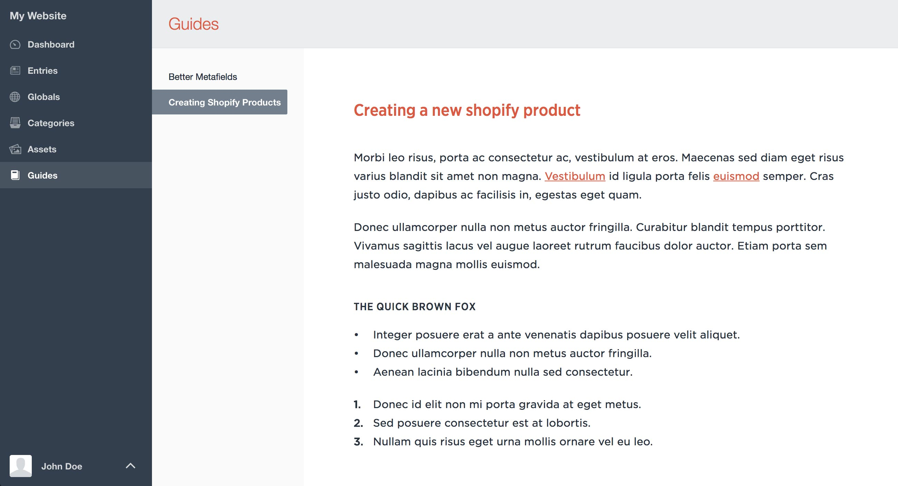

# Guides plugin for Craft CMS

An easy way to provide documentation in the Craft control panel.

---

## Features

Everybody loves good documentation. Guides makes it easy to create, edit, and present top-notch documentation for your team and/or clients directly within the Craft control panel.

- Completely customize the appearance of your content by providing the path to a stylesheet.
- Create your content as honest-to-goodness native Craft channel entries using rich text or plain text (with Markdown).

## Installation

To install Guides, follow these steps:

1. Download & unzip the file and place the `guides` directory into your `craft/plugins` directory
3. -OR- install with Composer via `composer require cmalven/guides`
4. Install plugin in the Craft Control Panel under Settings > Plugins
5. The plugin folder should be named `guides` for Craft to see it.  GitHub recently started appending `-master` (the branch name) to the name of the folder for zip file downloads.

Guides works on Craft 2.4.x and Craft 2.5.x.

## Setup

After installing Guides, there are a few additional steps you'll need to take in Craft to complete setup:

- Create a new `Channel` section with a handle of `guides` (this handle is customizable in the Guides plugin settings). `Entries in this section have their own URLs` _should not_ be checked.
- Create a new field to use for your content. You can call this field whatever you want, but `Guide Content` is a good name. The field type should be one of the following:
  + `Plain Text` with `Allow line breaks` checked
  + `Rich Text`
- Add the field you just created to your `Guides` section.
- Create a new Guides entry, save it, then click _Guides_ in the Craft sidebar nav. You should see your new content.

## Customizing Content Styles

Guides includes a `Stylesheet Path` setting that you can use to load a custom stylesheet (e.g. `dist/styles/guides.css`). This path is relative to your `siteUrl`. We recommend scoping all of your styles to a `.guide-plugin-content` selector to avoid overwriting any of Craft's default control panel styles.
